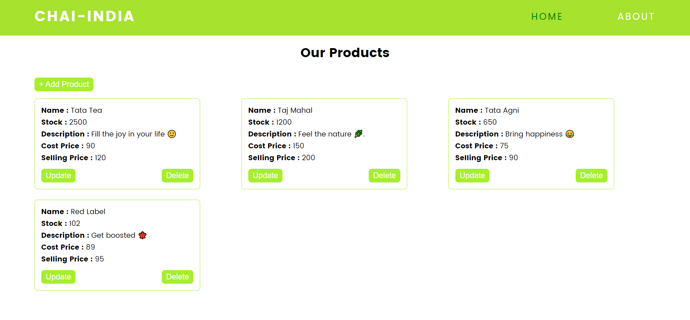
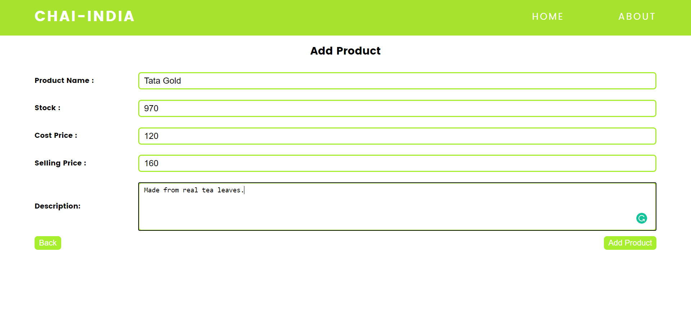
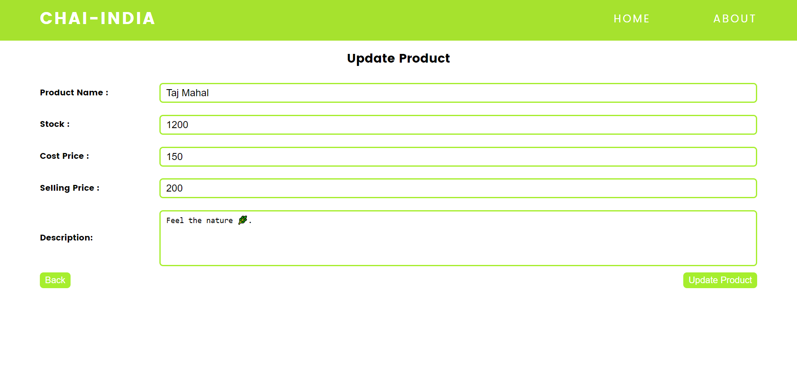

# Chai-India

> Chai India is a fast growing tea tech startup based out of New Delhi. We are on a mission to share our passion of Tea with the world.

## Tech Stack

- Frontend : ReactJS
- Backend : Node JS, ExpressJS
- Database : MongoDB, Mongoose

## Home Page



## Add Product



## Update Product



## Clone To Local Machine

```
    $ git clone https://github.com/healer9/chai-india.git
    $ cd client
    $ npm init
    $ cd ..
    $ cd server
    $ npm init
```

## Open Both Client & Server Directory in CLI

`run npm start in client directory`

> client is running on port : 3000 (locally)

`run npm start in server directory`

> serve is running on port : 5000 (locally)

## `Created By : Anas Riyaz 👽`

## `Assign By : Suraj Singh`
